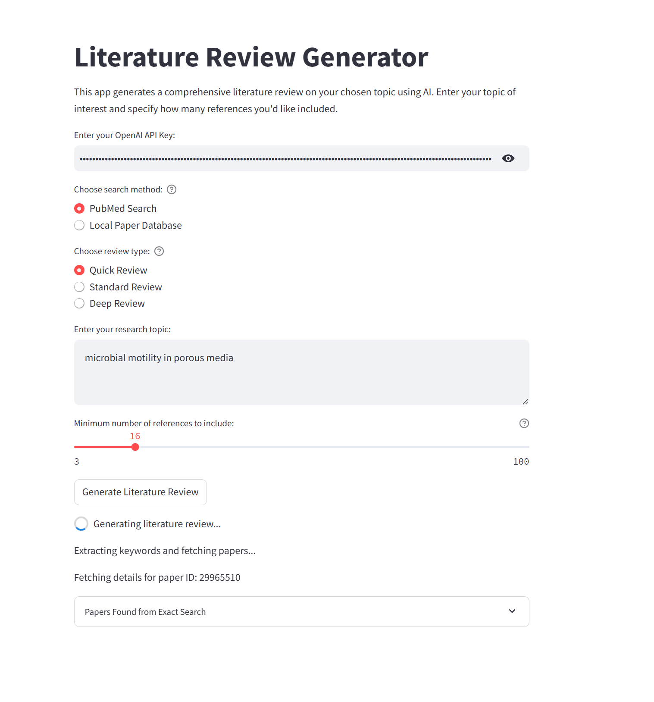
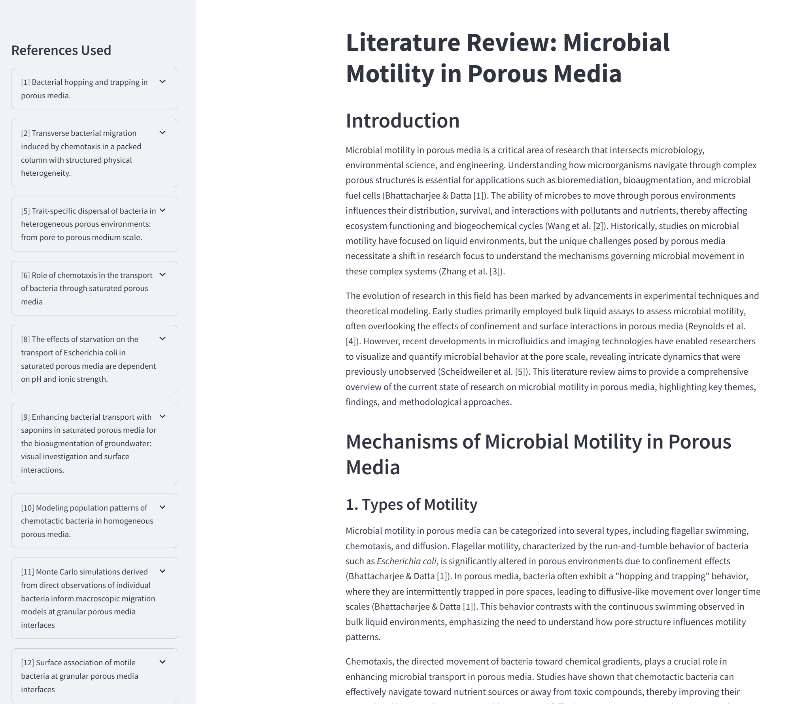

# AI-LitReview

A powerful Streamlit application that generates comprehensive literature reviews using AI. This tool combines the capabilities of advanced language models with academic search engines to create detailed, well-structured literature reviews on any research topic.

## Features

- **Multiple Search Methods**
  - PubMed Search: Real-time access to academic papers from PubMed
  - Local Paper Database: Use pre-downloaded papers for faster processing

- **Flexible Review Types**
  - Quick Review: Faster processing using GPT-4-turbo
  - Standard Review: Balanced approach using GPT-4
  - Deep Review: Most detailed analysis using Claude 3

- **Smart Paper Selection**
  - Automatically extracts relevant keywords from your topic
  - Combines results from both Google Scholar and PubMed
  - Prioritizes papers based on relevance and recency
  - Supports customizable minimum reference count (3-100)

- **Interactive Interface**
  - Real-time progress updates during generation
  - Expandable reference sidebar with paper details
  - Direct links to original papers when available

## How to Use

1. **Setup**

bash
git clone https://github.com/yourusername/AI-LitReview.git
cd AI-LitReview
pip install -r requirements.txt

2. **Launch the App**

bash
streamlit run app.py

3. **Generate a Review**
   - Enter your OpenAI API key
   - Select your preferred search method
   - Choose the review type based on your needs
   - Enter your research topic
   - Set the minimum number of references
   - Click "Generate Literature Review"

## Key Components

The application consists of several specialized agents working together:

1. **Literature Review Agent**: Generates comprehensive literature reviews by extracting keywords, locating relevant papers, and creating detailed narratives that place the research in context.

2. **Paper Selection Agent**: Handles the intelligent selection and ranking of papers based on relevance and importance to the research topic.

3. **Citation Alignment Agent**: Ensures proper citation formatting and alignment between in-text citations and bibliography.

## Output Format

The generated literature review includes:

- Comprehensive introduction
- Detailed main body with multiple sections
- Well-structured conclusion
- Properly formatted citations
- Complete bibliography
- Sidebar with expandable reference details including:
  - Paper titles
  - Authors
  - Publication dates
  - Direct links to papers
  - Key points from abstracts

## Requirements

- Python 3.8+
- OpenAI API key
- Internet connection for PubMed/Scholar searches
- Required Python packages:
  - streamlit
  - openai
  - pandas
  - beautifulsoup4
  - requests

## Notes

- The quality and depth of the review depend on the chosen review type
- Processing time varies based on the number of references and review type
- Internet connection quality affects search performance
- API usage costs apply based on your OpenAI plan

## Contributing

Contributions are welcome! Please feel free to submit a Pull Request.

## License

This project is licensed under the MIT License - see the LICENSE file for details.